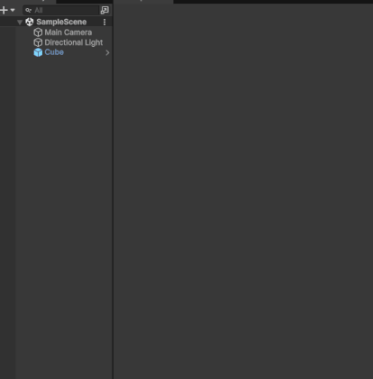

# Unity Inspector Components

A Unity package that draws all the components of a selected gameObject at the top of inspector.  
Use the toggles to hide everything else and focus on one component.  
Hold `Ctrl` or `Cmd` to isolate multiple components at once.  
To toggle On/Off the added inspector elements go to <kbd>Tools</kbd> > <kbd>Inspector Components</kbd> > <kbd>Enabled</kbd>.

Inspired by the concept of component toggling seen in asset *Wingman*.

Tested on
* 6000.0.60f1
* 6000.3.10f1



## Installation
#### Manifest
```json
"com.alexandros.inspectorcomponents": "https://github.com/alexisstrat/unity-inspector-components.git"
```

#### PackageManager
<kbd>Package Manager</kbd> > <kbd>+</kbd> > <kbd>Install from package from git URL</kbd>.
```
https://github.com/alexisstrat/unity-inspector-components.git
```

##  License
This project is licensed under the **MIT License** - see the [LICENSE](LICENSE) file for details.